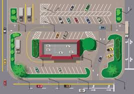

# Entrega1_Trabajo_Final

<table>
    <thead>
        <tr>
            <td rowspan="3">
                
            </td>
            <td align="center">
                <h1><b>Programación y Algoritmia</b></h1>
            </td>
            <td rowspan="3">
                
            </td>
        </tr>
        <tr>
            <td align="center">
                <h1><b>Trabajo_Final</b></h1>
            </td>
        </tr>
        <tr>
            <td>
                
            </td>
        </tr>
    </thead>
</table>

  <h2> <b> Por: Marlon Atehortua S. </b> </h2>
<a href="mailto:marlon.atehortua@udea.edu.co"> ✉ Marlon Atehortua Suaza </a>
  <h2> <b> Por: Daniel Alessandro Salinas L. </b> </h2>
<a href="mailto:dalessandro.salinas@udea.edu.co"> ✉ Daniel Alessandro Salinas Landinez </a>
  <h2> <b> Por: Annie Sequeda J. </b> </h2>
<a href="mailto:annie.sequeda@udea.edu.co"> ✉ Annie Sequeda Jaramillo </a>

 
# * Descripción del problema a solucionar -parqueadero la cueva del auto** 

El parqueadero la cueva del auto es un espacio que presta su servicio a vehículos del sector de la Universidad de Antioquia. Este solo permite el
ingreso de automóviles, el ingreso de motos no es aceptado. 
El parqueadero la cueva del auto cuenta con tres personas que trabajan turnos de 6 horas para atender a los usuarios que ingresan a usar el servicio y no presentar interrupciones ni contratiempos en el horario de 6:00 a.m. a 12:00 p.m. en jornada continua. El programa debe registrar usuarios,
ingresar y retirar vehículos y generar reportes administrativos.
Para solucionar este problema los estudiantes en grupos de tres integrantes deberán crear un
programa que se encargue gestionar el parqueadero la cueva del auto, en donde mediante entregas programadas y detalladas se pueda alcanzar el propósito de desarrollo. El programa debe ser entregado en un repositorio de GitHub en donde el líder del equipo será el encargado de crear
y gestionar el espacio de desarrollo.

# **Objetivo**

Crear un programa de consola visualmente amigable al usuario, en donde permita gestionar la
atención del parqueadero, para posteriormente exportar los resultados a un archivo plano (CSV).
# **Reglas**

## Actas de entendimiento y compromiso.

Los integrantes del grupo deben definir su participación y responsabilidad mediante actas de entendimiento. Estas se describen a continuación:
*   ### Objetivo de entendimiento y compromiso
>Este procedimiento tiene como objetivo establecer las normas y directrices para la creación de actas de entendimiento, colaboración y responsabilidad en trabajos grupales académicos. Busca promover un ambiente de trabajo colaborativo y respetuoso, asegurando que todos los miembros del grupo comprendan y acuerden sus roles y responsabilidades.

*   ### Alcance
>Este procedimiento aplica a todos los estudiantes vinculados a un equipo para la entrega del trabajo final.
>*  #### Definiciones (Entregables)
>>*   Acta de Entendimiento: Documento que detalla los objetivos comunes del grupo y las expectativas de cada miembro respecto al proyecto.
>>*   Acta de Colaboración: Documento que especifica las metodologías de trabajo en equipo, incluyendo estrategias de comunicación y resolución de conflictos.
>>*   Acta de Responsabilidad: Documento que asigna tareas específicas a cada miembro del grupo, estableciendo plazos y criterios de evaluación.
Procedimientos (Entregables)
>>*   Convocatoria de Reunión: El grupo deberá convocar a una reunión inicial para discutir los objetivos del proyecto y elaborar el Acta de Entendimiento.
>>*   Elaboración del Acta de Entendimiento: Durante la reunión, los miembros del grupo discutirán y acordarán los objetivos y expectativas del proyecto. Esta acta será redactada por un miembro designado y luego revisada y firmada por todos los integrantes.
>>*   Elaboración del Acta de Colaboración: Posteriormente, se redactará el Acta de Colaboración, donde se definirán las normas de trabajo en equipo, incluyendo los canales y frecuencia de comunicación.
>>*   Asignación de Responsabilidades: Finalmente, se creará el Acta de Responsabilidad, detallando las tareas específicas de cada miembro, así como los plazos de entrega. Cada miembro del grupo deberá firmar este documento, aceptando sus responsabilidades.
>*  #### Seguimiento y Evaluación (Entregables)
>>*   Reuniones de Seguimiento: El grupo deberá realizar reuniones periódicas para evaluar el progreso del proyecto y hacer ajustes necesarios en las actas.
>>*   Revisión de Actas: Las actas pueden ser revisadas y modificadas con el consentimiento de todos los miembros del grupo, según sea necesario para reflejar cambios en el proyecto o en la dinámica del equipo.
>*  #### Resolución de Conflictos
>>*   En caso de desacuerdos o conflictos, el grupo deberá referirse al Acta de Colaboración para resolver la situación mediante los mecanismos previamente acordados. Si no se llega a una resolución, se consultará con el del curso para mediación.
>* **##2.Vinculos academicos y  descripción.**
>>* Soy Marlon Atehortua, curso el programa de Ingeniería Industrial, la habilidad principal mia es la capacidad de liderazgo y la fortaleza es que me adapto a las circunstancias para poder lograr los objtevios propuestos.
>>* Soy Daniel Salinas, curso el programa de Ingeniería Industrial, soy una persona honesta, líder con capacidad de trabajar muy fácil en grupo me desenvuelvo muy fácil hacia los retos nuevos que me pongan y sé trabajar bajo presión si ningún problema.
>>* Soy Annie Sequeda, curso el programa de Ingneniería Industrial, Soy una persona disciplinada, comprometida y enfocada en lograr resultados. Me gusta mantenerme concentrado en los objetivos, ser responsable con lo que hago y adaptarme fácilmente a diferentes situaciones. También se me da bien organizar mi tiempo, pensar de forma analítica y comunicarme con claridad.

## **3.	Nombre del proyecto y detalles**

 El nombre del programa es la cueva del auto, trata sobre el desarrollo de un software donde permitirá registrar usuarios, controlar entradas y salidas de vehículos,
 calcular cobros y generar reportes administrativos, optimizando la operación diaria del servicio.
 
## **4.	Licencia del software**

Esta obra está bajo licencia CC BY-SA 4.0 

## ** 5. Reporte de visión **

**Descripción general del software**:
Este programa está diseñado para gestionar el parqueadero la cueva del auto, ubicado en el sector de la Universidad de Antioquia. Su propósito es automatizar y optimizar los procesos manuales actuales como el registro de usuarios, control de ingreso y salida de vehículos, cálculo de tarifas por tiempo de uso, generación de reportes y entrega de facturas.

**Objetivos**:
* Reemplazar el registro manual por un sistema digital eficiente.
* Controlar y monitorear en tiempo real los espacios disponibles.
* Automatizar el cobro por uso del parqueadero.
* Generar reportes administrativos para la toma de decisiones.
* Mejorar la experiencia del usuario al reducir tiempos de espera y errores.
  
**Beneficios**:

* Mayor organización y control del parqueadero.
* Reducción de errores humanos y pérdida de información.
* Mejora en la atención al usuario.
* Facilidad para generar informes y estadísticas.
## **6.  Especificacion de requisitos**

*   Los requisitos funcionales definen las acciones específicas, comportamientos, y operaciones que el software debe ejecutar para satisfacer las necesidades del usuario final.
*   Los requisitos no funcionales especifican criterios que pueden usarse para juzgar la operación del sistema, más allá de los comportamientos específicos. Esto incluye aspectos como el rendimiento, seguridad, usabilidad, fiabilidad, y compatibilidad.
  
### **Requisitos Funcionales**:
1. Registro de usuarios:
   - El sistema debe permitir registrar los datos de los usuarios que ingresan al parqueadero.
2. Ingreso de vehículos:
   - El sistema debe registrar la hora y minuto exacto en que un vehículo entra al parqueadero.
3. Salida de vehículos:
   - El sistema debe permitir registrar la salida de un vehículo y calcular el tiempo total de permanencia.
4. Cálculo del valor a pagar:
   - El sistema debe calcular el cobro en función del tiempo de uso (por hora y fracción).
5. Control de disponibilidad:
   - El sistema debe mostrar y actualizar en tiempo real la cantidad de espacios disponibles (64 en total).
6. Generación de facturas:
   - El sistema debe generar un comprobante de pago con la información del usuario, tiempo de permanencia y valor pagado.
7. Gestión de reportes:
   - El sistema debe generar reportes administrativos con datos como número de vehículos diarios, ingresos generados y ocupación promedio.
8. Gestión de turnos del personal:
   - El sistema debe registrar los horarios del personal encargado de la operación (tres turnos de 6 horas).
### **Requisitos No Funcionales**:
1. Usabilidad:
   - El sistema debe ser fácil de usar mediante una interfaz de consola clara e intuitiva.
2. Rendimiento:
   - El sistema debe procesar registros e ingresos de forma rápida y sin demoras perceptibles.
3. Fiabilidad:
   - El sistema debe garantizar que los datos almacenados (entradas, salidas, cobros) no se pierdan durante la operación.
4. Seguridad:
   - El sistema debe restringir el acceso a funciones administrativas mediante una autenticación básica.
5. Compatibilidad:
   - El sistema debe poder ejecutarse en cualquier sistema operativo que soporte Python (Windows, Linux, macOS).
6. Mantenibilidad:
   - El código debe estar estructurado y documentado para facilitar su comprensión y futuras mejoras.
7. Escalabilidad:
   - El sistema debe estar preparado para una futura adaptación a una interfaz gráfica o conexión con bases de datos

## **7.	Plan de proyecto**

-Actas: Realización de actas de entendimiento y compromiso en la fase inicial del proyecto.    
-Entrega 1: Elaboración del primer entregable donde se describe de manera textual las intenciones y funcionabilidad del proyecto.    
-Análisis de requisitos: Entendimiento de los requisitos exigidos para la correcta realización y ejecución del programa.    
-Desarrollo del modelo: Producción del programa que se requiere crear para el parqueadero.    
-Exportación de datos: Subir lo datos.    
-pruebas y depuración: Hacer pruebas para encontrar errores funcionales del programa y depurarlos.    
-Creación manual del usuario: Explicar cómo utilizar adecuadamente el programa.    
-Entrega final: Entrega definitiva del programa.    

Para este proyecto se invertirán 84 horas trabajadas por 3 estudiantes de Ingeniería Industrial, lo que equivale a 1,68 SMLV.
